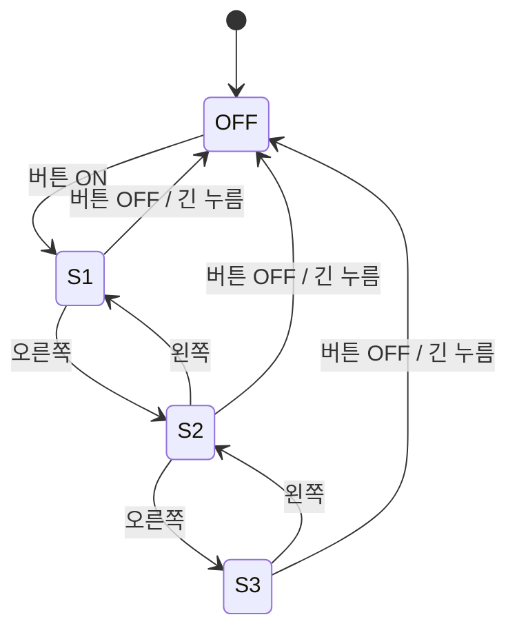

# OFF / S1 / S2 / S3 상태 규칙

Member 2의 원래 네 가지 enum과 `mode / power / speed` 구조를 사용한다.
`mode`가 기준이며 State만 세 필드를 함께 갱신한다. GPIO/PWM을 직접 접근하지 않는다.

| Mode | power | speed | 현재 모터 duty |
|---|---|---|---|
| OFF | false | 0 | 0% |
| S1 | true | 2 | 60% |
| S2 | true | 5 | 80% |
| S3 | true | 8 | 100% |

2/5/8은 논리 출력 값이며 PWM의 20/50/80%를 의미하지 않는다.

| 이벤트 | OFF | S1 | S2 | S3 |
|---|---|---|---|---|
| POWER_TOGGLE (엔코더 짧게 눌렀다 떼기) | S1 | OFF | OFF | OFF |
| SPEED_UP / ROTATE_CW | OFF | S2 | S3 | S3 |
| SPEED_DOWN / ROTATE_CCW | OFF | S1 | S1 | S2 |
| SHORT_PRESS (원래 버튼 전환 호환) | S1 | S2 | S3 | S1 |
| LONG_PRESS (2초 이상) | OFF | OFF | OFF | OFF |
| NEAR (자동 모드 접근) | S1 | S1 | S2 | S3 |
| FAR / SENSOR_LOST | OFF | OFF | OFF | OFF |
| NONE | OFF | S1 | S2 | S3 |

원래 SHORT_PRESS 순환은 API와 `build/test_state --demo`에서 유지한다.
현재 엔코더 버튼의 짧은 입력은 POWER_TOGGLE을 발생시킨다.
잘못된 mode는 OFF로 복구하고, power/speed 불일치는 mode에 맞춰 복구한다.
ERROR/알 수 없는 이벤트는 Main에서 정지 후 실패 종료한다.

초음파 입력 조건은 Event가 처리하며 State에 near/blocked 필드를 추가하지 않는다.
`--auto`에서는 20cm 이하에 처음 접근하면 NEAR, 20cm 초과로 나가면 FAR이다.
가까운 상태에서 버튼 OFF 후에는 다시 버튼 ON 또는 멀어졌다 접근해야 시작한다.
Timeout/invalid distance는 SENSOR_LOST로 정지한다. 측정이 복구되면 재접근으로
처리하되 버튼 OFF 차단은 실제 FAR 또는 버튼 ON이 있기 전까지 유지한다.
거리 밖에서는 엔코더 입력을 무시한다. 기본 모드는 초음파를 읽지 않는다.
