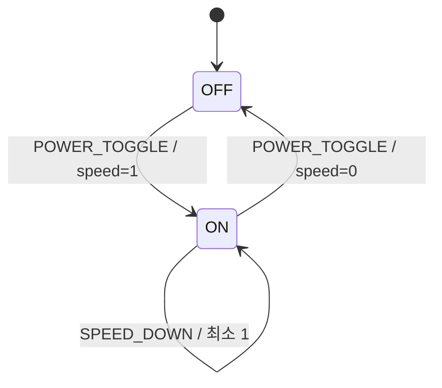

# 상태 전환 설계 초안

담당: Member 2

초기 상태는 OFF / speed 0이다. 전환 로직은 `handle_event()`의 TODO로 남겨 두었다.

| 현재 상태 | 이벤트 | 목표 상태 |
|---|---|---|
| OFF | POWER_TOGGLE | ON / 1 |
| OFF | SPEED_UP / SPEED_DOWN | OFF / 0 |
| ON / 1~7 | SPEED_UP | 현재 단계 +1 |
| ON / 8 | SPEED_UP | ON / 8 |
| ON / 2~8 | SPEED_DOWN | 현재 단계 -1 |
| ON / 1 | SPEED_DOWN | ON / 1 |
| ON | POWER_TOGGLE | OFF / 0 |
| 모든 상태 | EVENT_NONE | 유지 |

TODO: 이벤트 거리 기준, 유지 시간 및 우선순위를 Member 1과 협의한다.
TODO: 종료/장치 오류 시 안전 정지 흐름을 정의한다.
